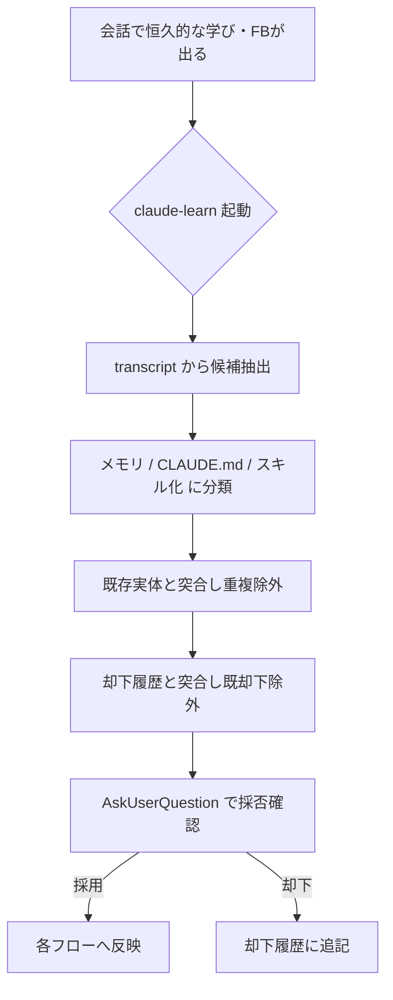

# claude-learn — 会話からのナレッジ更新・スキル化

## 概要

いまの会話で得た「今後に残す価値のある学び」を精査し、**メモリ / CLAUDE.md / スキル**の適切な保存先へ振り分けて反映する単一ディスパッチャ。保存先や作り方（メモリ運用ルール、`superpowers:writing-skills`）は既に揃っているので、このスキルが埋めるのは「いま何を・どこに残すか」を会話の流れの中で判断し着手する部分。

保存前に必ずユーザーへ採否を確認する。既出・却下済みは提案しない。

## 分類

| 保存先 | 対象 | 反映方法 |
|--------|------|----------|
| **メモリ** (`~/.claude/projects/<slug>/memory/`) | 会話をまたいで効く事実・背景・参照先 | 1ファイル1事実。frontmatter（`name`/`description`/`metadata.type` = user\|feedback\|project\|reference）。`MEMORY.md` に1行ポインタを追記 |
| **CLAUDE.md** | 恒久的な作業規則 | グローバル `~/.claude/CLAUDE.md` かプロジェクト `CLAUDE.md` かを内容で判断。**既存規則の改善**（矛盾の修正・重複の整理・陳腐化した記述の更新）も含む。共有物なので追記・変更は慎重に |
| **スキル化** | 手順化できる反復作業 | `superpowers:writing-skills` を呼ぶ。既存スキルの改善もここ |

## 手順

1. 現在の transcript を読み、残す価値のある学びを候補として抽出する。
2. 各候補を上表の3分類へ振り分ける。
3. **重複除外**: 既存の `MEMORY.md` / 両 `CLAUDE.md` / `claude/skills/` と突合し、既出の候補は落とす。
4. **却下履歴突合**: 却下履歴ファイルを読み、意味的に一致する候補は提案しない。
5. 分類結果をユーザーに提示し、採否を確認する（グローバル CLAUDE.md の規則に従い **AskUserQuestion** を使う）。
6. 採用分を各フローへ反映する。
7. **却下分**を却下履歴に1行正規化して追記する（`- YYYY-MM-DD: <1行サマリ>`）。

## メモリ保存の流儀

- 1ファイル = 1事実。`metadata.type` は `user`（ユーザー像）/ `feedback`（仕事の進め方への指示。**Why:** と **How to apply:** を添える）/ `project`（相対日付は絶対日付に変換）/ `reference`（外部リソースへのポインタ）。
- 本文中で関連メモリを `[[name]]` でリンクする。
- 保存前に既存ファイルを確認し、重複するなら新規作成でなく既存を更新する。誤りが判明したメモリは削除する。
- リポジトリが既に記録している事実（コード構造・過去の修正・git 履歴・CLAUDE.md）は保存しない。

## 却下履歴ファイル

- パス: `~/.claude/learn-candidates/<cwd-slug>.md`。マシンローカル（dotfiles / git 管理外、同期対象外）。
- `<cwd-slug>` は cwd の英数字以外を `-` に置換したもの。ディレクトリが無ければこのスキルが `mkdir -p` で作る。
- 人間可読の Markdown 追記（機械突合しないため JSON 不要）。このスキルのみが読み書きする。
- 目的: 一度「残さない」と判断した候補を次回以降に再提案しないため。
